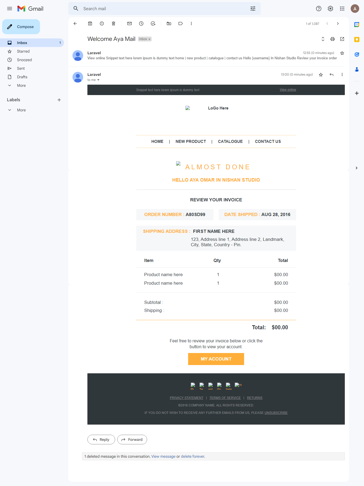
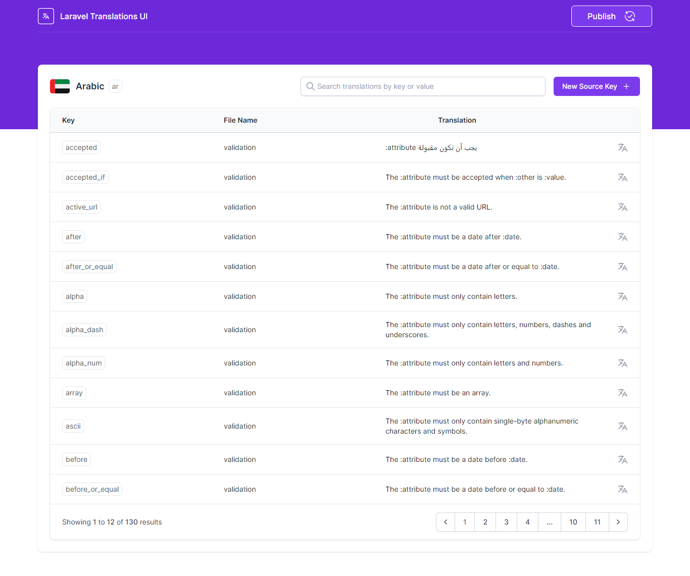

## Using this package I have make this email template editor
#### You can access this package after installing from this link: <a href="http://127.0.0.1:8000/maileclipse/mailables">Click Here</a>
<a href="https://github.com/Qoraiche/laravel-mail-editor">Mailable Editor</a>

 
 
 
## I have also used a package for translation
<a href="https://github.com/MohmmedAshraf/laravel-translations">laravel-translations</a>

